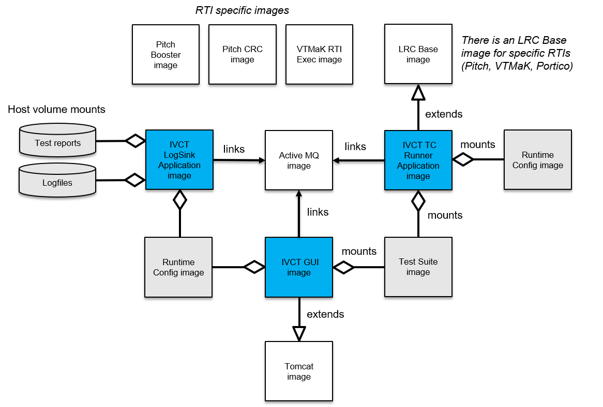

= IVCT Container Overview

The containerized version of the IVCT consists of several Docker container images. An overview of the container images and the relationships between them is provided in the following figure.

The color coding of the images is:

- **BLUE**: IVCT container images (I.e. TC Runner Application, IVCT GUI, and IVCT LogSink Application).
- **GREY**: IVCT data volumes (as container image or other storage class).
- **WHITE**: These are outside the scope of the IVCT project. E.g. the HLA RTI related container images.

The relationships are:

- **links**: container image establishes network connection to other container image at run-time.
- **extends**: container image is based on the other container image (see Dockerfile `FROM` instruction).
- **mounts**: container image mounts the indicated data volume at run-time.
