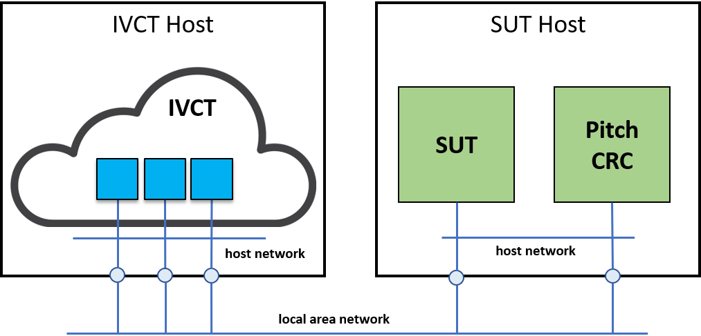
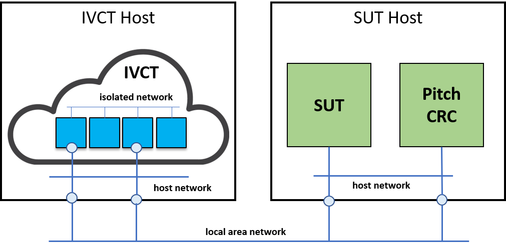

= IVCT Deployment Options

There are various ways the IVCT container images can be composed together in terms of networking, data volumes, and configuration.

The two types of compositions - called deployment options - provided for the IVCT are called `host mode` and `overlay mode`.

== Host mode
With this deployment option the IVCT containers in the composition share the host's networking namespace. Each container gets the IP address of the IVCT Host and is directly accessible from the local area network as if the container application runs on the host itself rather than on an isolated Docker overlay network. Host mode networking gives also a better performance as it does not require the network address translation (NAT) used in the overlay mode. The option is summarized in the figure below. Published container ports are visible on the local area network.

This deployment option is the recommended way to deploy the IVCT. It allows the use of TCP/IP, UDP/IP and Multicast communication with the SUT without restrictions.

Note however that is option only works on Linux hosts, and is not supported on Docker Desktop for Mac, Docker Desktop for Windows, or Docker EE for Windows Server.

== Overlay mode
With this deployment option the IVCT containers in the composition are attached to an overlay network. Communication between the containers is across this isolated network on the Docker Host, and not visible to other applications on the IVCT Host or elsewhere on the local area network. Containers can expose ports to the IVCT Host so that applications on the local area network can access the service provided by the composition. Docker transparently sets up port mapping (NAT) between the internal container port and external (published) service port. This option is summarized in the figure below.

This deployment option is only recommended when using reliable communication (i.e. TCP/IP) between the IVCT and the SUT.

* VTMaK RTI: The default VTMaK RTI RID file has been configured to use reliable communication (TCP/IP) only. UDP/IP is not supported in this deployment option.

* Pitch RTI: Both TCP/IP and UDP/IP is possible, by setting some LRC specific environment variables in the IVCT compose file.

Multicast is not possible with this deployment option, regardless what RTI implementation is used.

== RTI Specific Components
Additional, but RTI specific components may be employed to connect the IVCT to the SUT. For example Pitch Booster or MaK Forwarder. These components can be used to bridge different network domains, but the application of these tools is outside the scope of this project.

== Summary

.Supported Network communication protocols per deployment option and per RTI
|===
|Deployment option | Pitch | VTMaK | Portico

|Host mode
|TCP/IP, UDP/IP, Multicast
|TCP/IP, UDP/IP, Multicast
|Multicast
|Overlay mode
|TCP/IP, UDP/IP
|TCP/IP
|-
|===

Note that the FOM transportation indication (Reliable, Best Effort) typically implies a certain network communication protocol to be used. I.e. Best Effort typically implies UDP/IP or Multicast, and Reliable typically implies TCP/IP. In case of the VTMaK RTI, the RID file is configured to use TCP/IP regardless of the FOM transportation indication.

== References
https://docs.docker.com/network/host/
