= Explore the Grapical User Interface

== Introduction

The Graphical User Interface (GUI) is a webbrowser based application. You need to open your preferred HTML browser and navigate to the IVCT home page. In a local and standard deployment, this would typically be:

  http:/localhost:8080

In the standard deployment, the first page will be the login screen. Only authorized users are allowed to use the IVCT. With an initial deployment the default user name and password is `admin` and `admin`.

image:images/GUI_Login.png[Login Screen]

After a successful login the IVCT UI will be started. The general layout concept consists of a menu bar on the top part of the page, a navigation frame on the left side with a blue background, and content frame on the right side with a white background.

The Navigation frame has three parts, selectable via the little ‘^’ in the top left corner. The first one is the so called “Badges” view, the second one is the “Testsuites” view, and the third one is the “System under Test” view. These views are described below in more detail.

== The Badge View

In the badge view, all installed compliance badges are shown. While no badge is selected in the navigation frame, the content frame shows the same overview list in an iconic layout.

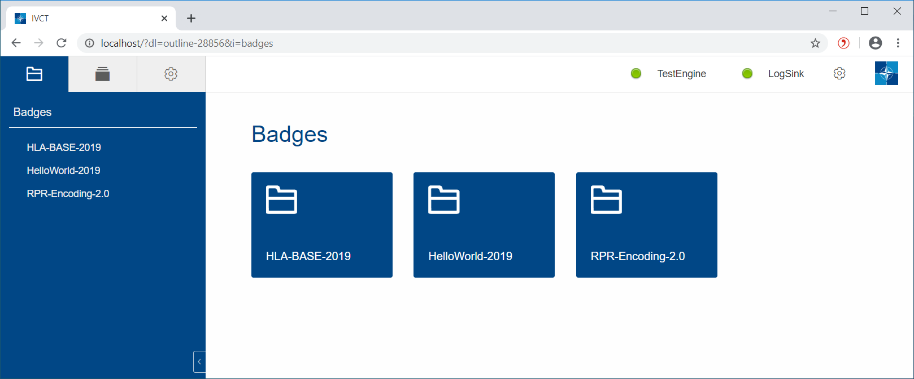

When a badge is selected in the navigation frame, the details will be shown in the content frame. These general information like the name, the version, a short description and a visual key representing the badge.
A badge also contains interoperability requirements, either directly assigned to the badge, or indirectly by a dependency definition to another badge. These interoperability requirements are assigned to test cases, which need to be passed in order to be considered compliant to that badge.

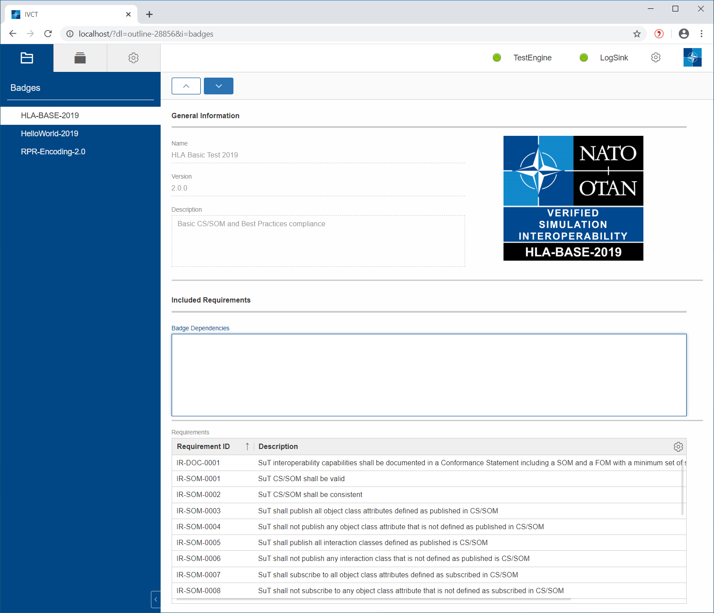

== The Testsuite View

The test suite view shows all included test suites in the IVCT platform.

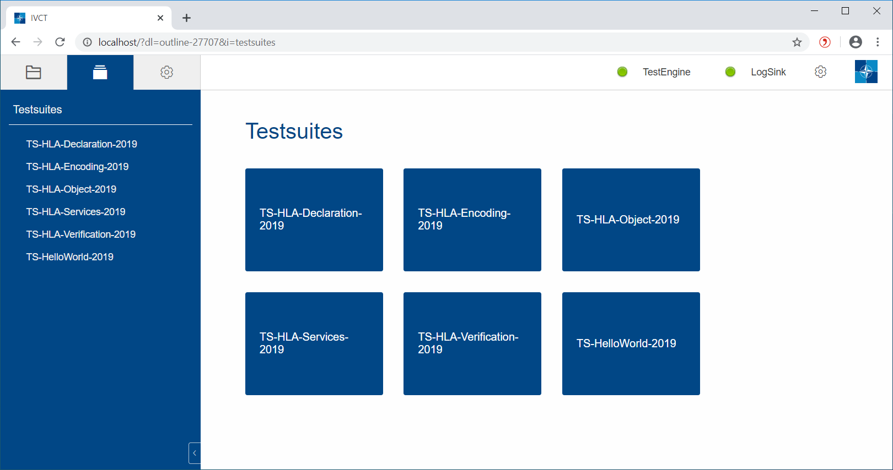

When you select an test suite definition, additional information such as name, version, description and assigned test cases are displayed.
If you select a special test case, the assigned interoperability requirements are displayed.

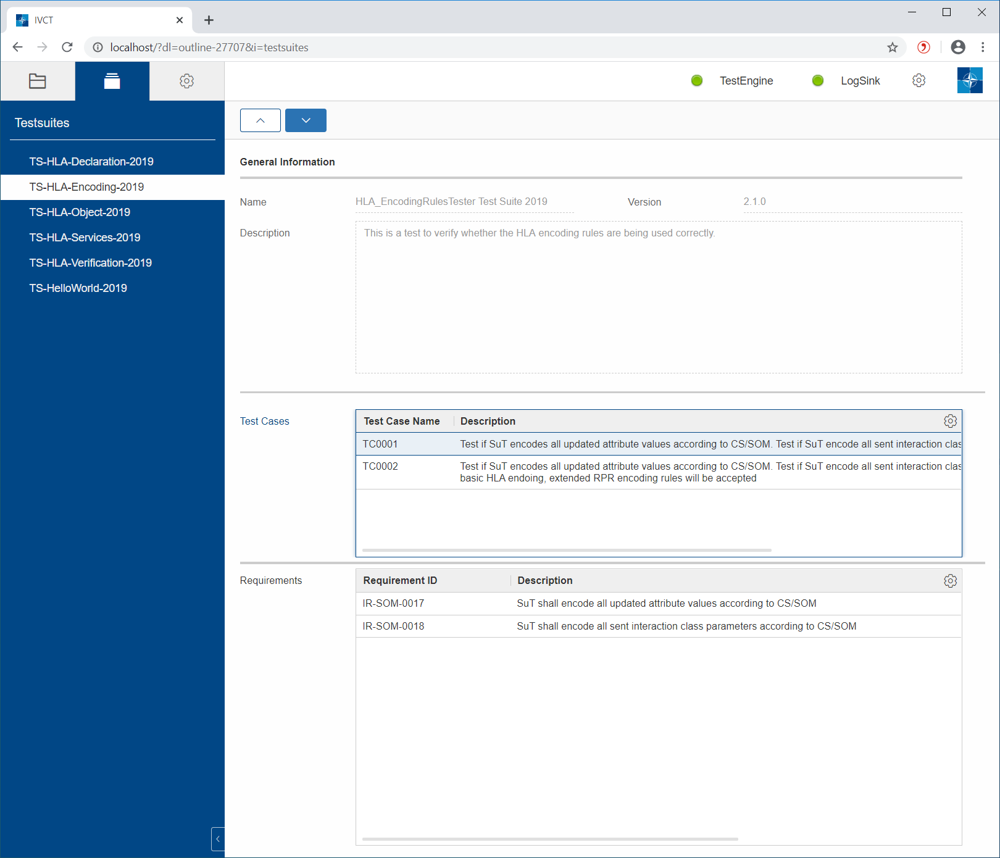

== The SuT View

The System under Test (SuT) view, shows the configure systems to be tested. New systems for testing can be added with the menu <SUT Settings - New SuT> and existing configurations can be edited, after selecting them. The selection of a SuT shows the details view for that system under test.

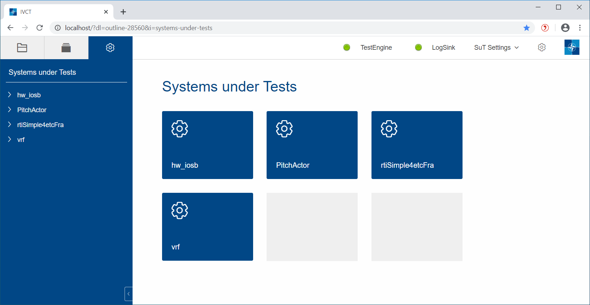

The details view shows general information about the system under test, such as its name, vender and version, a short description of its purpose, as well as information for the IVCT on how to connect to the `HLA RTI`. This connection information is called the `Local Settings Designator` (LSD) and the value is passed as-is to the `RTI Connection` call. For more information about the LSD, see <<IVCT-Local-Settings-Designator#,The Local Settings Designator>>. Furthermore, the federate name and the federation name can be specified.

Below the general information the capability status shows the selected capabilities with the badge id, the badge name and a conformance status after testing the interoperability requirements of the selected badge.

Below the capability status section is the test report section.
A test report can be generated if the selected SuT has already been tested.
The created test reports are listed below the capability status field.
A test report can be downloaded by double-clicking and opened with a PDF viewer.

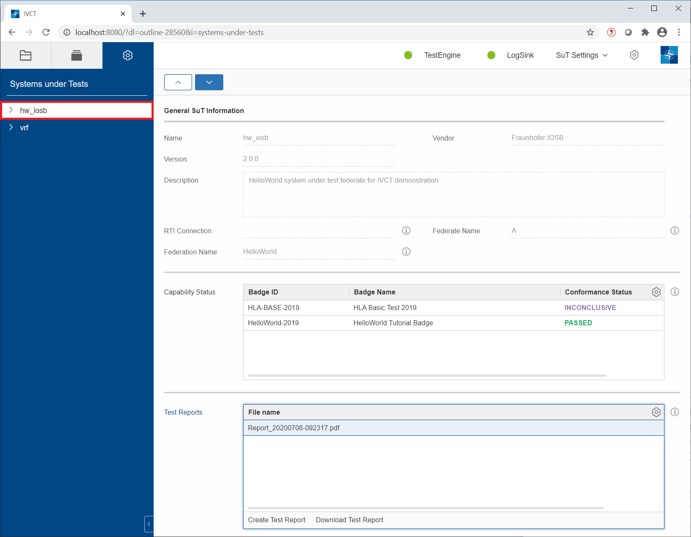

When selecting a SuT in the navigation frame, the underlying badges are shown.
These are the badges which are named in the conformance statement when creating a SuT description.
Selecting a badge will show all contained test suites.

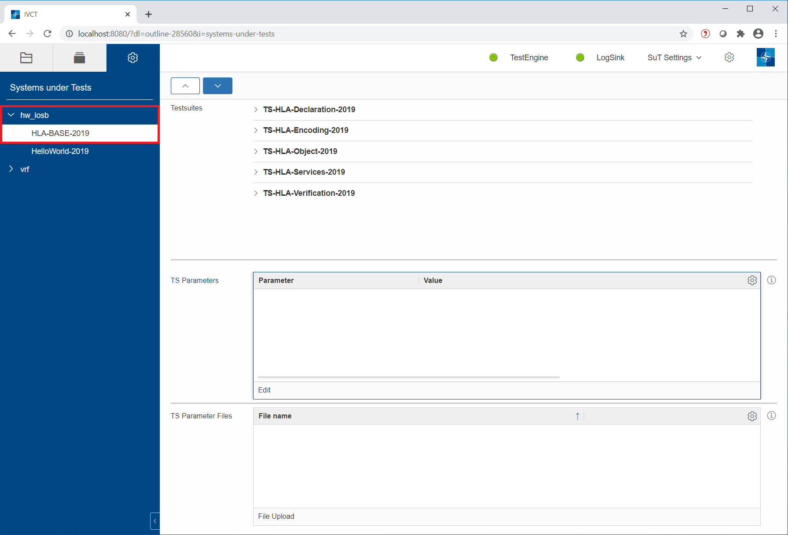

Selecting a test suite will show the included test case tiles and the details to be used for testing.
These are test case parameters, optionally some extra parameters as required by some test cases.

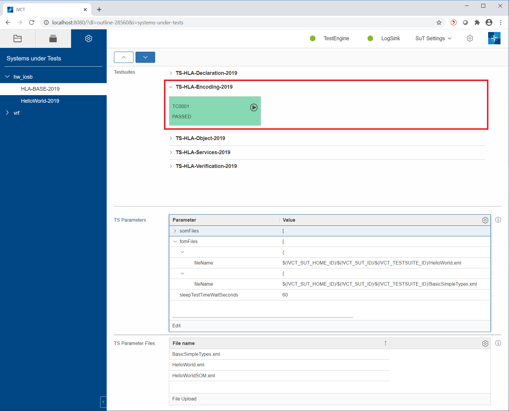

When selecting a test case tile the list of interoperability requirements are shown in the requirement table.

Depending on the status of the test execution, the test case tiles are displayed in different colors:

- **PASSED**: green color
- **INCONCLUSIVE**: purple color
- **FAILED**: red color

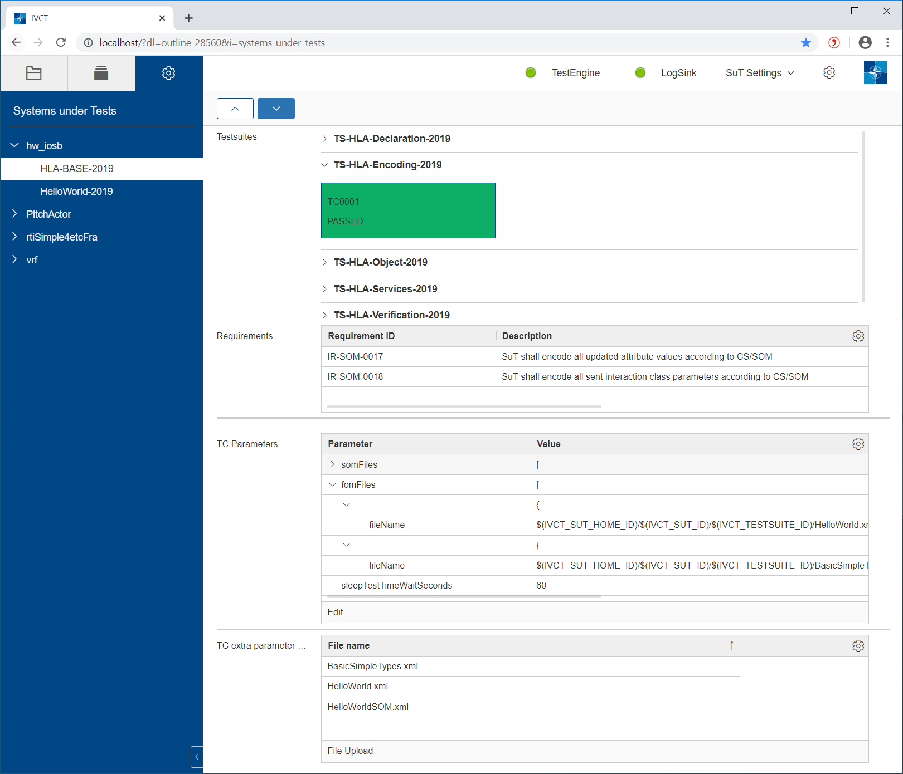

In order to execute a test case, it must be selected in the navigation frame (double click on the test case tile).
That opens a detail view in the content frame, with a short description and a list of reports with existing protocol files.
With the button <TC execute> in the menu frame, the test case assigned to this interoperability requirement can be started.

Depending on the status of the test execution, the test result name in <TC Status> and <TC Execution History> are displayed in different colors:

- **PASSED**: green color
- **INCONCLUSIVE**: purple color
- **FAILED**: red color

The <TC Execution Log> table displays the log message selected in the <TC Execution History> table.
Log messages with the log level error are colored red.
Log messages with the log level warning colored yellow.

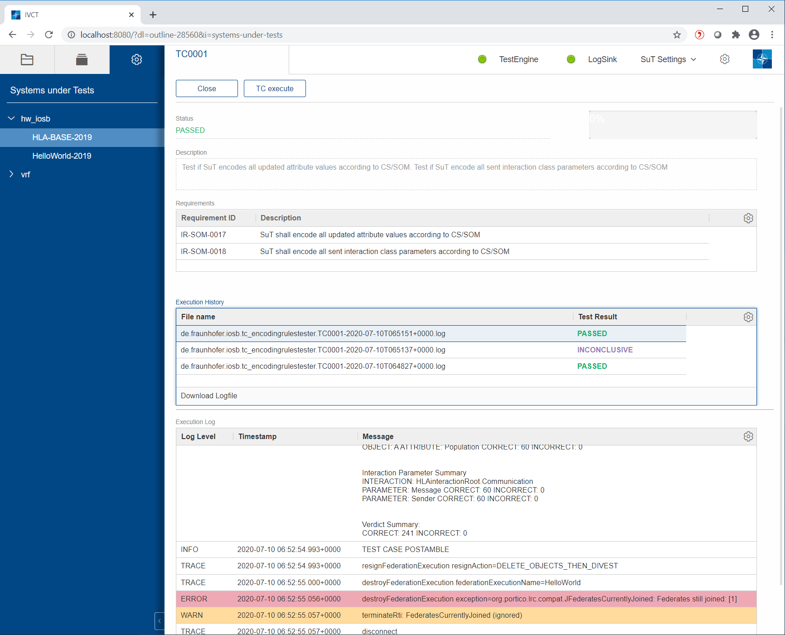

After the start of a test case, the current status of the running test case is displayed in a progress bar.
The messages in the status table are created by the test case and will give insights on the current test activity.
A detailed protocol log shows the current output of the running test case.

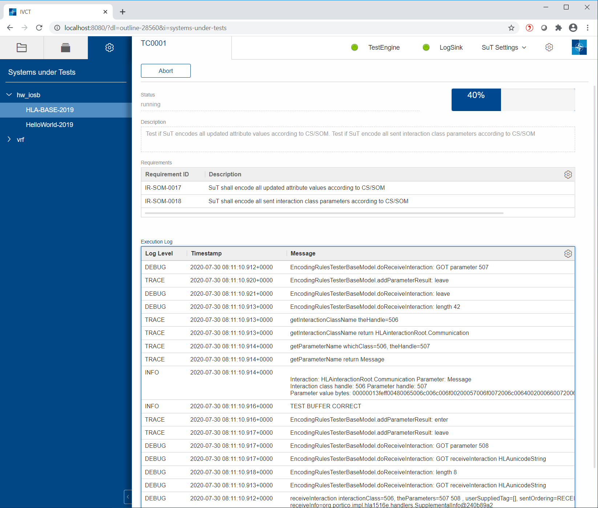

Some testcases do have specific instructions to the IVCT operator.
The test case makes a request to the SuT operator and waits until the SuT operator confirms that the required action or configuration has been performed.
An optional comment for traceability can be added.

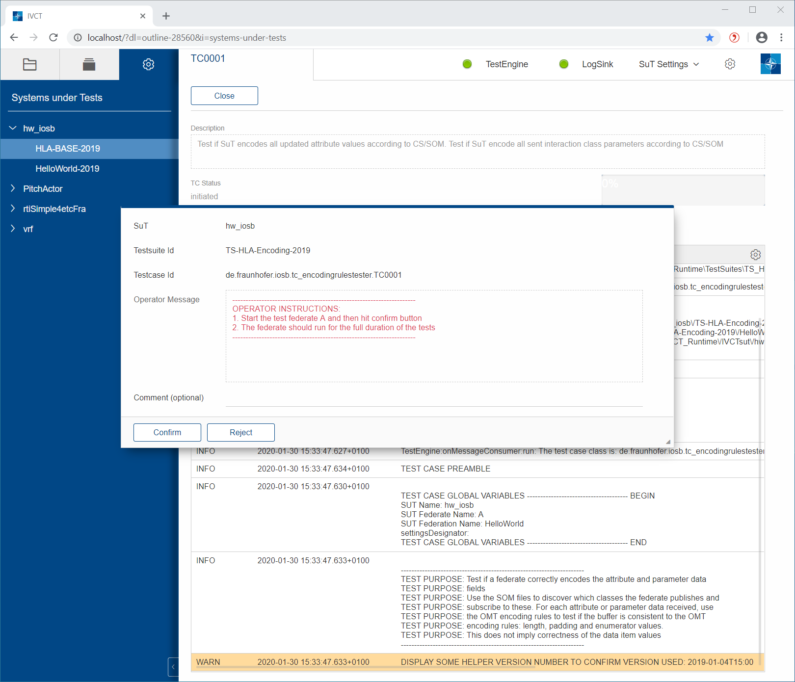

At the end of the test case execution, the  test verdict is displayed in form of a popup window.

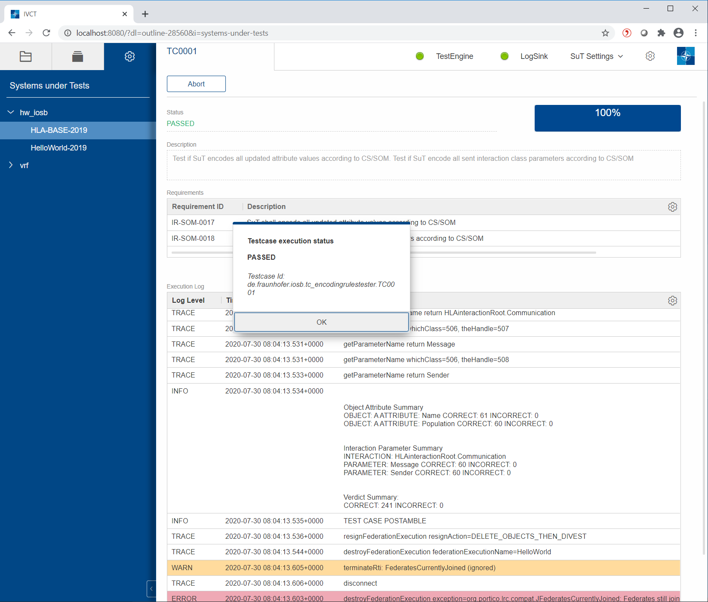

== SuT Capability Status / Conformance Status

Below the general information the capability status shows the selected capabilities with the badge id, the badge name and a conformance status after testing the interoperability requirements of the selected badge.
The conformance status can have four defined statements:

- **PASSED**: The SuT satisfies the interoperability requirements of the badge (green color).
- **FAILED**: The SuT does not satisfy the interoperability requirements of the badge (red color).
- **INCONCLUSIVE**: The test cases was executed, but no statement could be made regarding the interoperability requirements of the badge (in consequence of connection problems and so on) (purple color).
- **UNKNOWN**: The interoperability requirements defined in the badge have not been tested yet (black color).

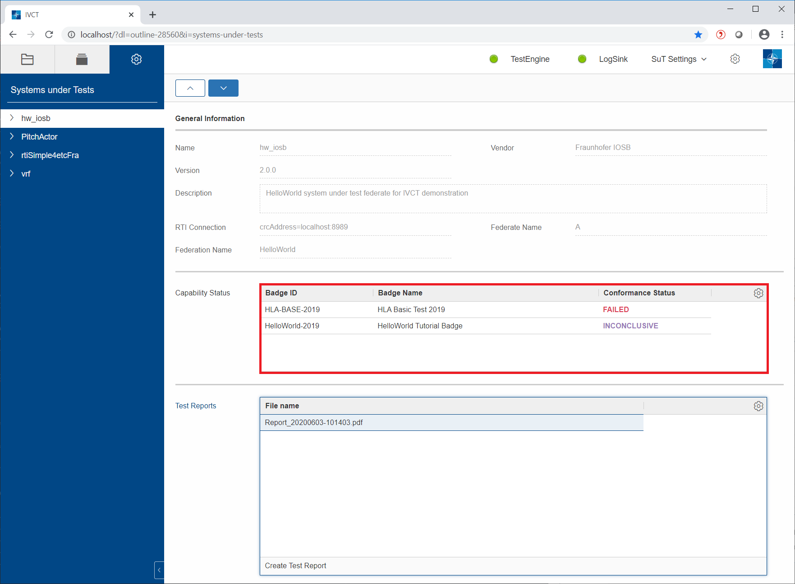

**Conformance Status - PASSED:**

The conformance status of a badge is **PASSED**, if all included test suite have the status PASSED.
In the following figure <Testsuite A> and <Testsuite B> have the status PASSED.

A test suite is PASSED if the last execution of all test cases of a test suite are Passed.
**Significant is only the last execution of a test case!**
In the following figure all test cases (TC) of <Testsuite A> and all test cases (TC) of <Testsuite B> have the status PASSED.
Therefore both test suite have the status PASSED.

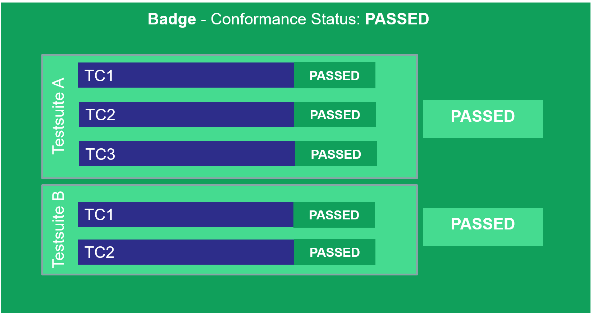

**Conformance Status - FAILED:**

The conformance status is **FAILED**, if one or more test suites have the status FAILED.
In the following figure <Testsuite A> is PASSED but <Testsuite B> is FAILED.
Test suite <Testsuite B> is FAILED because the last execution of a test case (TC2) is failed.

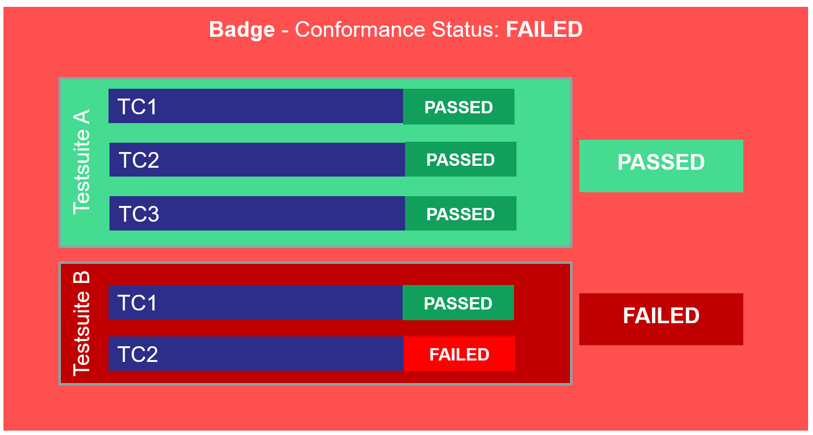

**Conformance Status - INCONCLUSIVE:**

The conformance status is **INCONCLUSIVE**, because a test suite has the status INCONCLUSIVE.
In the following figure <Testsuite A> is PASSED but <Testsuite B> is INCONCLUSIVE.
Test suite <Testsuite B> is INCONCLUSIVE because the last execution of a test case (TC2) is INCONCLUSIVE.

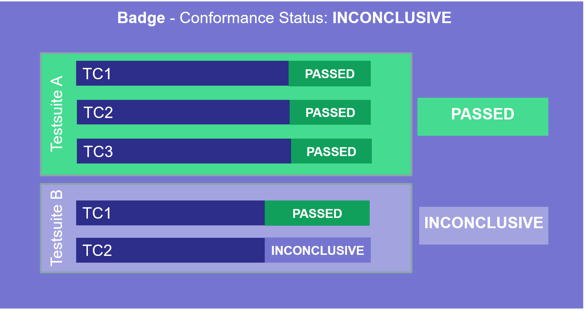

**Conformance Status - UNKNOWN:**

The conformance status is **UNKNOWN**, if the interoperability requirements defined in the badge have not been tested yet.
The interoperability requirements are tested using test cases.

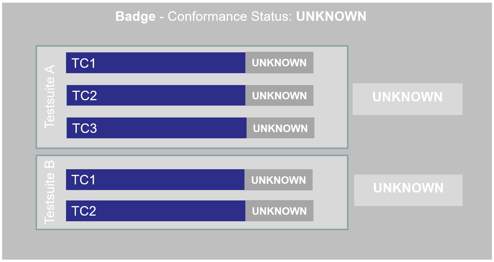

== Create Test Report

**The IVCT system enables the creation of a test report for the test inspector.**

In the test report section (third section) the test report for the SuT can be generated by clicking the button <Create Test Report>.
A test report can be generated if the selected SuT has already been tested.
The created test reports are listed below the capability status field.
A test report can be downloaded by double-clicking and opened with a PDF viewer.

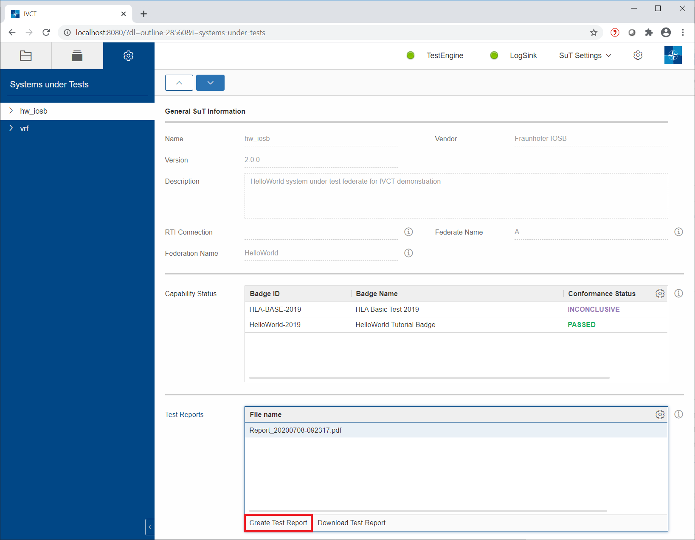

**The overview page of the test report is structured as follows:**

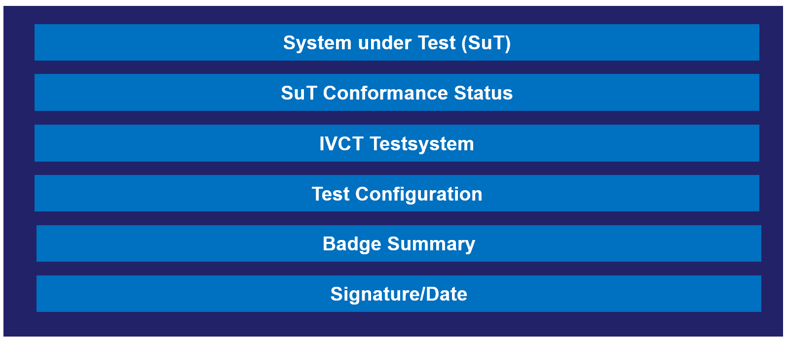

**The badge section of the test report is structured as follows:**

- **Badge section:** First, all linked badges are displayed with there information.
- **Testsuite (TS) section:** Additionally the badge section displays all assigned test suites and their information.
- **Testcase (TC) section:** In the test suite section all assigned test cases are displayed. Beside the test case information the tested interoperability requirements, the result of the last test case execution and the corresponding logfile are displayed.

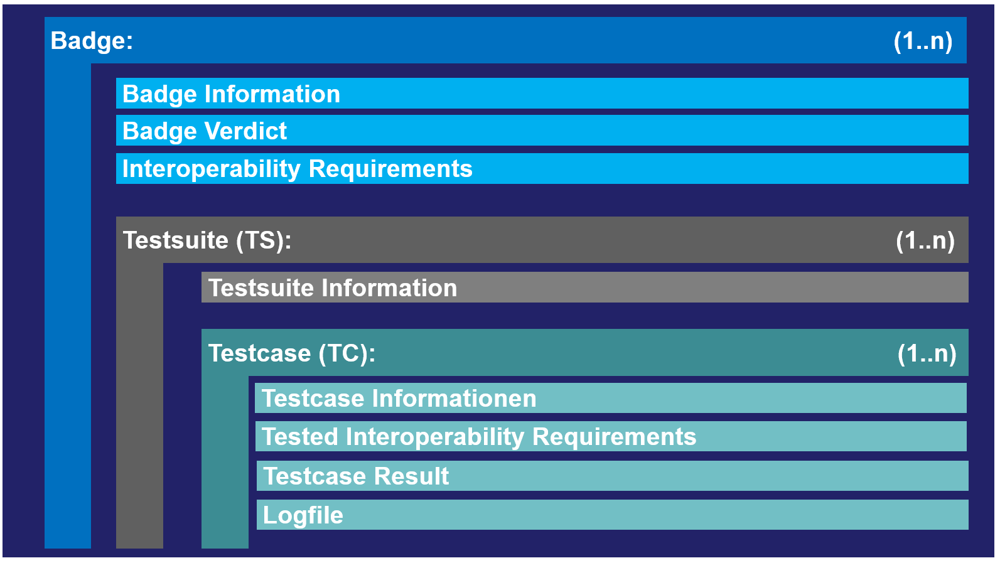

The one-to-many relationship in the figure should show that several badges, test suites and test cases can be displayed in the report.

**Here is an report example:** (only the overview page is displayed)

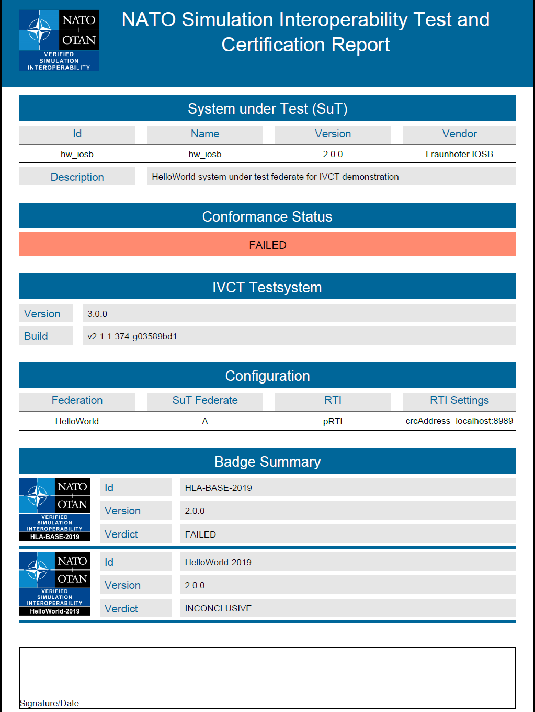

- **The conformance status of the SuT is PASSED, if all linked badges have the status PASSED!**

== SuT Create / Edit / Delete

The creation, editing and deletion of SuTs is possible via the menu item <SuT Settings>.

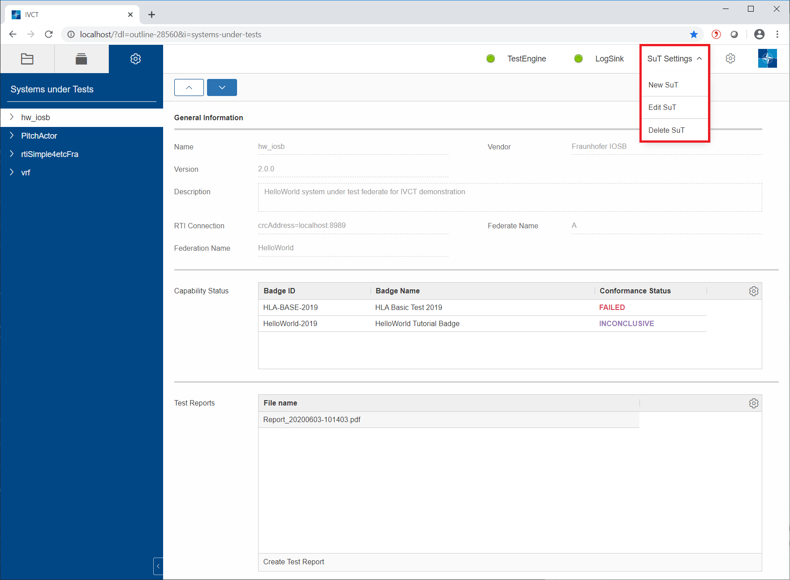

When creating and editing SuTs, the descriptions are opened in an editing tab.
In the edit mode you can change the Name, Vendor, Version, RTI Connection, Federate Name, Federation Name and the Description of the SuT.

An important part is the definition of the SuT Capabilities.
**The selection of the available badges, is considered as the conformance statement of the SuT.**
This selection will define the interoperability requirements to be used for the compliance testing.

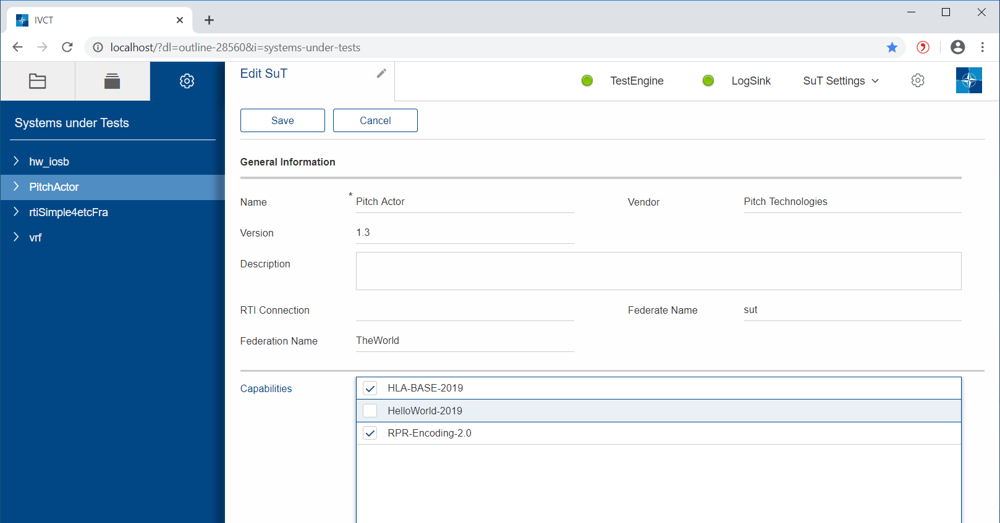

The IVCT system allows the deletion of SuTs.
Before a SuT can be deleted, the SuT must be selected in the left menu.
Then the delete function is available in the <SuT Settings> menu.
A safety request must be confirmed before the deletion process.
**Attention: All SuT information as well as the entire test case history and all test reports are permanently deleted!**

== Additional information

=== Language and Log Level Settings

The system allows the user to change the language settings and log level settings. You can select either English or German as language. The default language is English.

As log level you can decide between the following levels:

- TRACE: Detailed information about the individual test steps, like the HLA API calls and callbacks.
- DEBUG: This level contains specfic developer information used for testing the test cases.
- INFO: High level information about the test execution.
- WARN: The warning level reports events which need the attention of the IVCT operator.
- ERROR: Events which are considered as faulty behaviour are reported as errors.

The default log level is INFO.

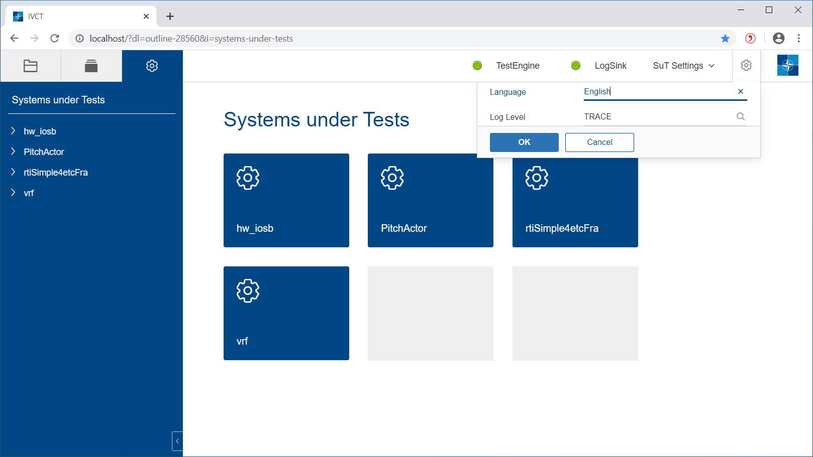

=== TestEngine and LogSink Status

The TestEngine and LogSink status is shown in the user interface.
The status display shows whether the components are currently available and reports if they are no longer accessible.

With a green status display the components are available.

With a yellow status display the components are currently not available.

image:images/GUI_TestEngineStatusYellow.PNG[TestEngine Status]

With a red status display the components are not available.

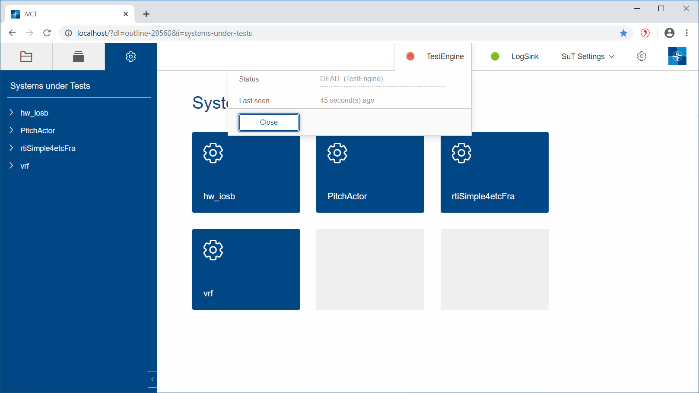

=== IVCT Version and Logout

System information, such as the software version of the IVCT environment, can be displayed via the menu item <About>.
The menu item <Logout> logs the user off the system.

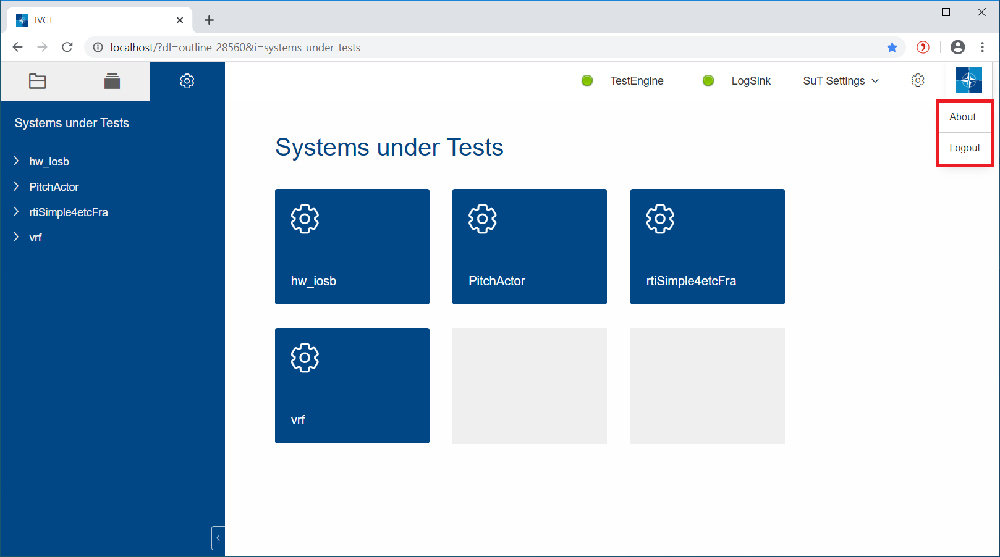

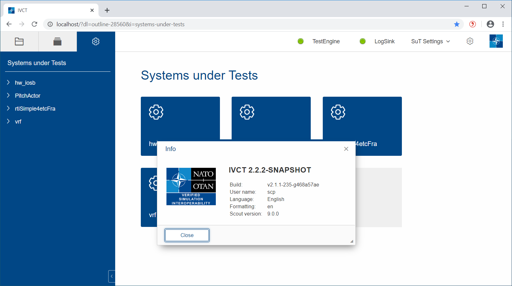

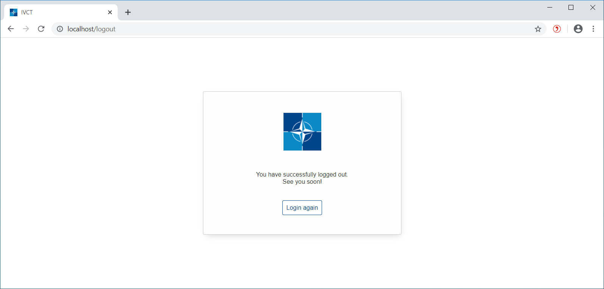
