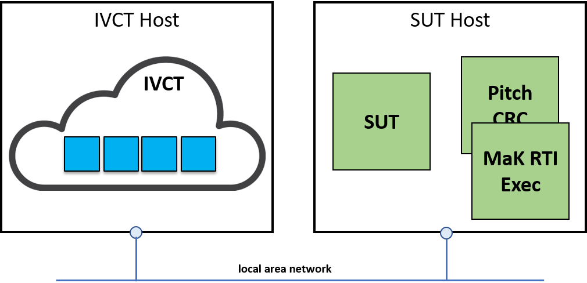

= IVCT Host and SUT Host

Although technically the IVCT and SUT may be installed on the same host machine, the recommendation is to have the IVCT and SUT each installed on a dedicated host.

The IVCT requires a Docker Engine and associated operating system version. This version may however conflict with the requirements of the SUT. By placing the IVCT and SUT on different hosts, version conflicts or inconsistencies can be prevented. In addition, resource usage (network, storage and processing) is also more clearly separated.

Additional RTI components required for the execution of tests such as the `Pitch CRC` and `MaK RTI Exec` should be placed on either the SUT Host or on another dedicated host (but not the IVCT Host).

The recommended hosting is illustrated in the following figure. Note that for SUT certification this setup may be required.

