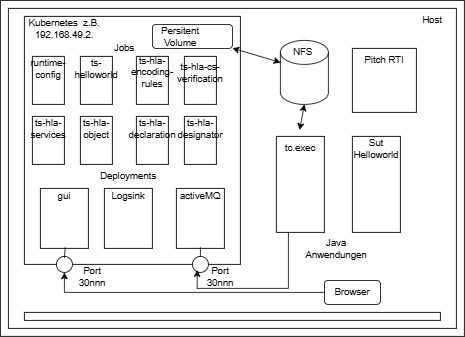

##  Bereitstellung einer containerisierten Variante des IVCT-Frameworks, basierend auf der im MSaaS-Hub verwendeten Container-Technologie

Die IVCT-Ablaufumgebung in der bisherigen Ausbaustufe basiert auf der Software-Container-Technologie von Docker. Für den MSaaS-Hub ist jedoch eine Konfiguration für eine Kubernetes Umgebung notwendig.
Docker und Kubernetes sind Lösungen für den Betrieb von Software-Container.  
Docker ist eine Plattform, die das Erstellen, Verpacken, Verteilen und Ausführen von Anwendungen in Containern vereinfacht.  
Kubernetes ist eine Umgebung, um (Docker-) Container-Anwendungen zu verwalten.
  
Die Aufgabenstellung bestand nun darin, das bisherige auf Docker basierte IVCT-Framework, für die Verwendung in Kubernetes-Clustern anzupassen.
  
Die eigentlichen Software-Container-Images sind in beiden Umgebungen kompatibel.  
Aber die Art wie Container definiert, konfiguriert und gestartet, und die Charasteristik der virtueller Umgebung in sie ausgeführt werden, ist zwischen der direkten Verwendung über docker-compose und der Verwendung in einem Kubernetes-Cluster unterschiedlich.  

Aus den für das bisherigen Docker Container-Deplomyent für IVCT verwendeten Vorlagen, den compose-Files, wurden alle Abschnitte analysiert und funktionsähnliche Kubernetes Anwendungs-Templates, den *.yaml Dateien erstellt.  
Dabei ist bei Kubernetes darauf zu achten, dass für verschiedene Aufgaben unterschiedliche Kubernetes Objekte über diese *.yaml Dateien zu erstellen sind, bei deren Start es ggf. auf die Reihenfolge ankommt.  
\- Volumes         definieren die Anbindung an einen (gemeinsam) nutzbaren Datenbereich z.B. NFS-Storage.  
\- Jobs               führen einen Task aus, kopieren bei IVCT gemeinsam zu nutzende Daten in das Volume  
\- Deployments  starten Container mit IVCT-Anwendungen z.B. activemq, IVCT-Test-Case-Runner, gui, logsink  
\- Service           stellen die Erreichbarkeit der in internen Netzen laufenden Container zur Verfügung.  

Zur Vereinfachung der Organisation des Betriebes (z.B. Start/Stop) der bis zu 20 Kubernetes-Objekte stehen  mehrere Verfahren zur Verfügung z.B. kubernetes-kustomize oder  Helm.

Um die Einrichtung der IVCT-Umgebung in einer Kubernetes Umgebung darzustellen wurde Minikube verwendet,  eine lokale Kubernetes installation, die die Kubernetes Standardfunktionen unterstützt.
  
In einer Variante wurde die komplette IVCT-TestUmgebung eingerichtet und gestartet. Die einzelnen Anwendungen liefen als Deployment/Pods und konnten untereinander kommunizieren. Die  Gui (grafische Benutzeroberfläche) wurde als Webapplikation vom (externen) Browser erreicht, die geladenen Test-Suites waren dort einsehbar.   Auch eine ausserhalb des Kubernetes-Clusters gestartete RTI wurde erkannt und "in" der RTI die angemeldeten Förderaten gesehen.
Die Ausführung von Test gelang so jedoch nicht, da die Kommunikation von der RTI  zu den in Kubernetes - Cluster gestarteten Anwendungen nicht gelang.

Eine Herausforderung bei dem Betrieb der IVCT-Umgebung in einem Kubernetes-Cluster sind die verteilten  Komponenten, auch ausserhalb des Clusters, die z.T. über "besondere" Ports miteinander kommunizieren, z.B  eine externe RTI mit dem Test-Case-Runner. Auch werden UDP-Ports (noch) nicht ausreichend unterstützt.  
Kubernetes stellt verschiedene Verfahren zur Verfügung um die (internen) Netzwerke/Dienste nach 'Aussen' bereitzustellen. (z.B. Services, port-forwarding, kubectl proxy, LoadBalancer, minikube tunnel, Ingres (http),...)   
Es sind aber ggf. auch weitere Netzwerk-Komponenten auf dem Host-System, oder im Netzwerk, anzupassen,  z.B.  Firewall, reverse-Proxy.  
Je nach Kubernetes-Umgebung, z.B. Rancher-Desktop, können diese Bedingungen unterschiedlich sein.  

Um diese Techniken gezielt einsetzen zu können, muss die genaue Konfiguration in den Images der zu startenden Container bekannt sein, und ebenso eine Konfigurationsmöglichkeit über z.B. beim Start zu übergebenden Variablen.  
Bei den derzeitigen Images z.B. des IVCT-Test-Case-Runner "tc-runner" sind diese internen Verwendungen der Variablen nicht bekannt, und eine Konfiguration-Änderung beim Start scheint nicht unterstützt zu werden.

### Vorgeschlagene lauffähige Umgebung:
Da es in der Testumgebung nicht gelungen ist, die Kommunikation zwischen der extern gestarteten RTI und den  innerhalb des Kubernetes-Cluster laufenden Anwendung Tc-runner (test-engine), und als Test-federate (SuT)  'Helloworld', herzustellen, wurde eine geteilte Anwendungs-Umgebung  verwendet.

IVCT in kubernetes-Cluster mit ausgelagerter Test Case Runner Anwendung (tc.exec)   :

Teile der IVCT-TestUmgebung; die Bereitstellung der Konfigurationen, Badges und TestCases, 
sowie die Anwendungen  GUI,  Logsink und activeMQ 
werden in einem  Kubernetes-Cluster (Minikube) eingerichtet und gestartet.  
Ein im Cluster definiertes und verwendetes persitent-Volume ist an ein externes NFS-Volume angebunden.  

Die Bereitstellung der Informationen und Definitionen für TestCases in dem gemeinsamen Datenbereich erfolgt über Images/Container deren Ausführung nur einmal notwendig ist,  den 'Jobs' .  
Die Anwendungen (gui, Logsink, activMQ) laufen als Deployment/Pods und können im Cluster untereinander kommunizieren.  
Eingerichtete  "Services" sorgen dafür, das die Anwendungen z.T. über bestimmte Ports von ausserhalb des Clusters erreichbar sind.  
So ist ActiveMQ von Anwendungen die ausserhalb des Clusters laufen erreichbar,
und die Gui als Webapplikation ist auf einem (externen) Browser darstellbar.  
Ausserhalb des Clusters werden ein IVCT-Test-Case-Runner (tc-runner-pi) und als SUT  eine HelloWorld-Anwendung  in konventioneller Form als java-Anwendung gestartet. (Dazu wird in der, von diesen verwendeten IVCT.properties, der durch den Cluster nach aussen bereitgestellte ActiveMQ-Port eingetragen.)  
Ausserdem wird (in diesem Fall auf dem gleichen Host)  eine Pitch RTI  ausgeführt.  
Die GUI-Webapplikation ist über den aus dem Cluster bereitgestellten Port verwendbar,  die TestEngine kann ausgewählt werden, die TestSuites sind in dieser  Webapplikation sichtbar.  
Nach Eintragung der Verbindung zu der RTI  (RTI Connection) im  Tab  'Systems under Tests'   für die  Test-SUT HelloWorld,  konnten TestCases erfolgreich gestartet werden.

